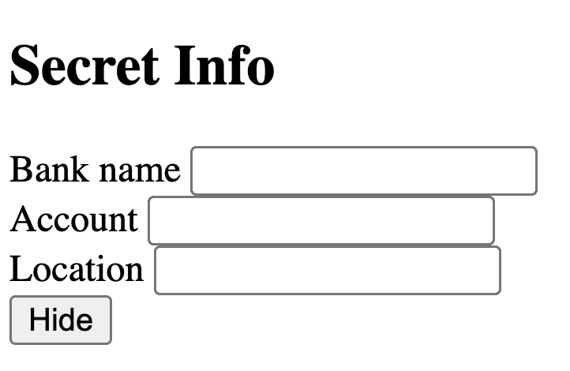
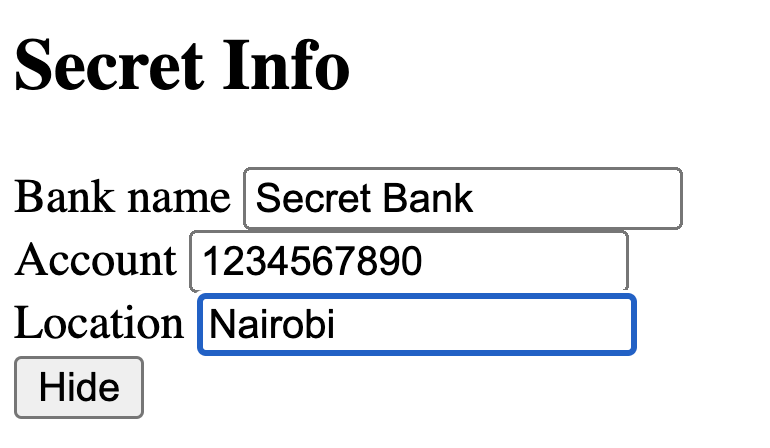
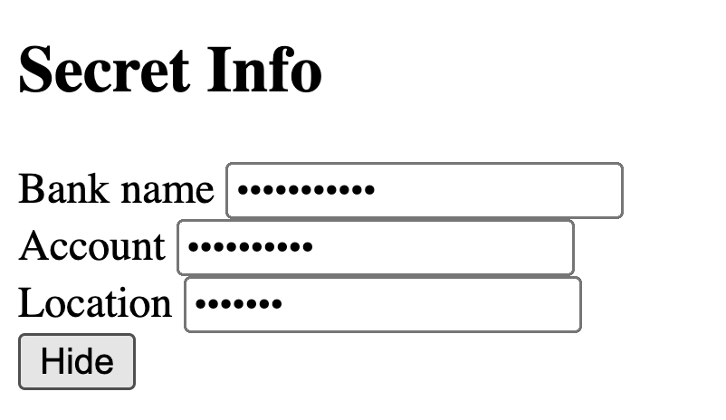

# MFR_DOM_manipulation

In this case, you have three inputs. When you enter information in them and click the hide button, the 
information must be hidden

See the behaviour here:

Create a branch in github with your name and upload the branch. Homework is done when you've created a pull request including me as a reviewer, to the main branch

