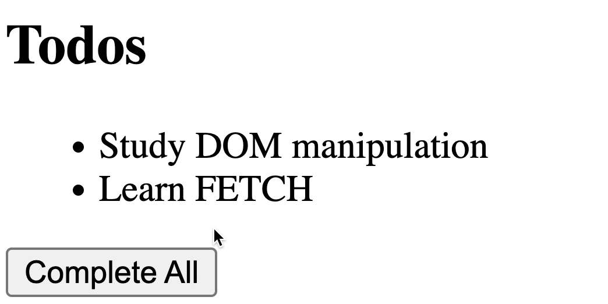
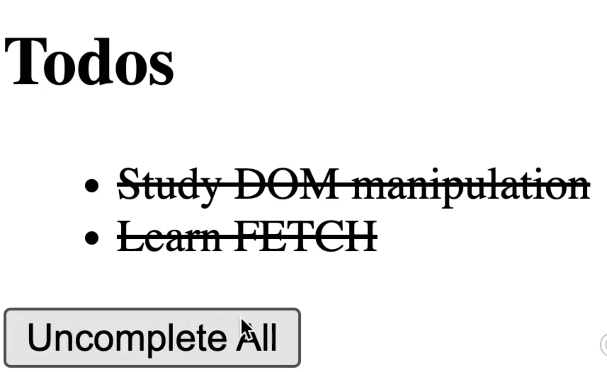

# MFR_DOM_manipulation

For homework, you have to create a list of elements that get strikenthrough when clicking a button, and then
they are cleared as well. Note the button changes its text from "complete All" to "uncomplete All".

See the behaviour here:

Create a branch in github with your name and upload the branch. Homework is done when you've created a pull request including me as a reviewer, to the main branch

